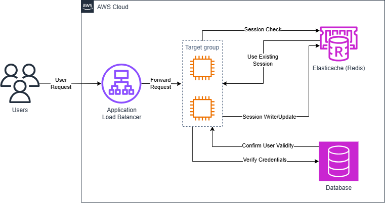

# Java Redis Login Demo – AWS Infrastructure (Terraform)

This repository contains the full AWS infrastructure for a Java Spring Boot login session demo using Redis session storage and an Application Load Balancer (ALB).  
All resources are fully automated using Terraform.

---

## Architecture Overview

The infrastructure provisions:

- VPC with 2 public subnets (multi-AZ)
- Application Load Balancer (ALB) for routing HTTP traffic
- EC2 instances (x2) running the Java application
- Redis (ElastiCache) used as a shared session store
- PostgreSQL (RDS) as the application database
- CloudWatch Dashboard for Redis monitoring
- IAM roles, security groups, and user-data provisioning

## Architecture Diagram



---

## Folder Structure
```
.
├── alb.tf
├── dashboard.tf
├── ec2.tf
├── elasticache.tf
├── main.tf
├── rds.tf
├── security.tf
├── terraform.tfvars
├── variables.tf
├── vpc.tf
├── user-data-ubuntu.sh
└── user-data-amazon-linux.sh
```


---

## Prerequisites

- Terraform version 1.6 or above
- Existing EC2 key pair
- AWS CLI configured with valid credentials
- Application JAR uploaded to your S3 bucket
  - Expected path: `s3://<bucket-name>/redis-session-login.jar`

---

## Variables Configuration

Update `terraform.tfvars` with your values:

```hcl
region        = "ap-southeast-3"
bucket_region = "ap-southeast-3"
bucket_name   = "your-s3-bucket"
key_name      = "your-keypair"

os_type       = "amazon-linux"   # or "ubuntu"
allowed_ip    = "YOUR_PUBLIC_IP/32"

db_username   = "appuser"
db_password   = "your-password"
db_name       = "appdb"
```

---

## Deployment

1. Initialize Terraform: 
```
terraform init
```

2. Validate configuration: 
```
terraform validate
```

3. Review changes: 
```
terraform plan
```

4. Deploy infrastructure: 
```
terraform apply
```


Terraform will output:

- ALB DNS name
- EC2 public IPs
- EC2 private IPs
- RDS endpoint
- Redis endpoint
- CloudWatch dashboard URL

---

## Cleanup

To destroy all resources:

```
terraform destroy
```


Note: RDS skip_final_snapshot = true is intentional for demo purposes.

---

## CloudWatch Dashboard

This project includes a Redis dashboard displaying:

- Current client connections
- CPU utilization
- Freeable memory
- Cache hits vs misses

The dashboard URL is included in Terraform outputs.

---

## Notes and Recommendations

- Public subnets and public EC2 instances are used for demo simplicity and should not be used in production.
- Redis and RDS accept traffic only from EC2 instances via security groups.
- ALB health checks use the Spring Boot Actuator endpoint: /actuator/health.

---